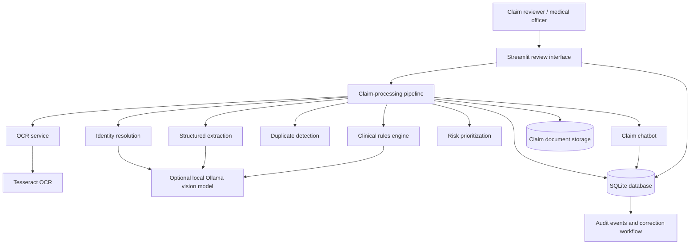

# MedClaim Sentinel

**AI-powered insurance claim review, medical document intelligence, duplicate-claim detection, clinical-consistency assessment, and medical-officer decision support.**

[](https://www.python.org/)
[](https://ollama.com/)
[](#project-status)
[](#responsible-use)

> [!CAUTION]
> **MedClaim Sentinel is a decision-support system. AI-generated observations must not be used as the sole basis for approving, rejecting, or altering an insurance claim. Final decisions must remain with authorized insurance and medical-review personnel.**

> [!IMPORTANT]
> Never commit real patient documents, protected health information, personally identifiable information, signatures, prescriptions, invoices, claim records, credentials, or a populated SQLite database to a public repository.

## 🎥 Project Demo

Watch the MedClaim Sentinel demonstration:

[](https://www.youtube.com/watch?v=83GTzouTPqI)

[▶ Watch the MedClaim Sentinel demonstration on YouTube](https://www.youtube.com/watch?v=83GTzouTPqI)

## Project overview

MedClaim Sentinel is a consulting-project prototype for insurance claim-processing teams. It brings claim intake, document OCR, identity review, duplicate detection, diagnosis–medicine–investigation consistency checks, financial extraction, risk prioritization, reviewer corrections, audit history, and claim-specific question answering into one review workflow.

The system is deliberately conservative:

- a submitted document is not automatically treated as clinically valid;
- a medicine-bill amount without medicine-level details is treated as insufficient evidence;
- a suspected mismatch is escalated for medical-officer review rather than used as an automatic rejection;
- local-AI output is preserved as supporting evidence and does not silently overwrite reviewed values;
- corrections proposed through chat require reviewer approval.

## Business problem

Insurance teams often receive several files for the same claim: claim forms, handwritten notes, prescriptions, pharmacy summaries, diagnostic bills, reports, identity details, and supporting correspondence. Manual review becomes difficult when:

- the same person submits multiple or overlapping applications;
- the same document appears in more than one claim;
- claimant names are faint, handwritten, or inconsistent across pages;
- a pharmacy summary contains amounts but no medicine names, strengths, quantities, or doses;
- investigations need to be assessed against the stated diagnosis;
- medical officers need to ask questions and correct extracted fields without repeating the entire intake process;
- partially processed claims remain in the pipeline and need controlled deletion or reprocessing.

## What the platform does

| Capability | Purpose |
|---|---|
| Document intake | Stores submitted claim documents under a claim-specific folder |
| OCR | Extracts text, confidence, and review regions from scanned medical documents |
| Identity review | Finds patient-name candidates and creates enlarged identity/signature crops |
| Structured extraction | Extracts totals, tests, medicines, providers, dates, policy/application identifiers, and warnings |
| Duplicate detection | Compares claim metadata, file hashes, perceptual hashes, and text similarity |
| Clinical consistency | Assesses diagnosis ↔ medicine, prescription ↔ pharmacy bill, and diagnosis ↔ investigation |
| Local AI | Optionally uses an Ollama vision-language model for difficult document interpretation and clinical cross-checking |
| Risk prioritization | Combines duplicate, clinical, OCR-confidence, and unsupported-amount indicators |
| Claim 360 | Presents identity, documents, duplicates, clinical checks, finance, corrections, and audit information |
| Medical-officer chat | Answers claim-specific questions and creates controlled correction proposals |
| Human review | Requires explicit approval before supported corrections change a claim |
| Deletion and reprocessing | Removes incomplete claims while retaining a minimal governance log |

## Responsible clinical statuses

The clinical review layer distinguishes between:

| Status | Meaning |
|---|---|
| `MATCHED` | Submitted evidence supports the assessed relationship |
| `PARTIALLY_MATCHED` | Some evidence is consistent, but the assessment is incomplete |
| `CONDITIONAL_MATCH` | The item may be appropriate only when an additional diagnosis, risk factor, history, or indication is present |
| `MISMATCH` | Available evidence appears inconsistent and requires medical-officer review |
| `INSUFFICIENT_EVIDENCE` | The system cannot assess the relationship because required evidence is absent or unreadable |
| `MEDICAL_OFFICER_REVIEW` | A qualified reviewer must make the final assessment |

`INSUFFICIENT_EVIDENCE` is **not** the same as `MISMATCH` and must not be treated as an automatic rejection reason.

## End-to-end workflow

```mermaid
flowchart LR
    A[Create or select claim] --> B[Upload claim documents]
    B --> C[Save files and calculate hashes]
    C --> D[OCR and identity-region extraction]
    D --> E[Structured document extraction]
    E --> F[Optional local vision-language analysis]
    F --> G[Merge evidence-backed fields]
    G --> H[Infer reviewable claim metadata]
    H --> I[Claim and document duplicate checks]
    I --> J[Deterministic clinical consistency checks]
    J --> K[Optional local-AI clinical cross-check]
    K --> L[Financial support and risk calculation]
    L --> M[Claim 360 dashboard]
    M --> N[Reviewer questions and correction proposals]
    N --> O[Human approval, audit, reprocess, or delete]
```



## Architecture



The public repository currently exposes the core Python package under `medclaim/`. The complete local application package should also contain the UI launcher, dependency file, setup/run scripts, tests, and any non-sensitive demonstration assets before the quick-start commands below are published as verified.

## Core package structure

```text
medclaim-sentinel/
├── medclaim/
│   ├── data/
│   │   └── clinical_rules.json
│   ├── services/
│   │   ├── chatbot.py
│   │   ├── clinical.py
│   │   ├── duplicate.py
│   │   ├── extract.py
│   │   ├── identity.py
│   │   ├── local_ai.py
│   │   ├── ocr.py
│   │   └── risk.py
│   ├── db.py
│   └── pipeline.py
├── storage/                    # Runtime only; do not commit populated content
├── wiki/                       # GitHub Wiki source pages
├── scripts/                    # Public-repository and Wiki helpers
├── README.md
├── ARCHITECTURE.md
├── DATA_DICTIONARY.md
├── PROJECT_STRUCTURE.md
├── SECURITY.md
├── PRIVACY.md
└── RESPONSIBLE_AI.md
```

## Key implementation components

### OCR and identity evidence

The OCR layer uses Tesseract through `pytesseract`, calculates SHA-256 hashes, produces OCR confidence values, and creates reviewer-friendly identity regions. Identity resolution combines labelled OCR candidates, cross-page corroboration, and an optional local vision model. It is designed to return uncertainty rather than inventing a name.

### Duplicate detection

Duplicate checks use several signals:

- exact file SHA-256 equality;
- perceptual-image-hash similarity;
- patient, policy, application, hospital, diagnosis, date, and amount similarity;
- OCR/text similarity;
- thresholds that separate probable, possible, and low-similarity matches.

A duplicate score is a review signal, not proof of fraud.

### Clinical consistency

The deterministic clinical engine uses `medclaim/data/clinical_rules.json` and structured reviewer inputs. It separately assesses:

1. diagnosis ↔ prescribed medicine;
2. prescribed medicine ↔ billed medicine;
3. diagnosis ↔ investigation/test;
4. evidence completeness.

Missing itemized medicines produce `INSUFFICIENT_EVIDENCE`, even when a pharmacy total is present.

### Local AI

The optional local-AI service communicates with Ollama and defaults to a configurable vision model such as `qwen2.5vl:7b`. It requests schema-constrained JSON, uses deterministic generation settings, records model metrics, and keeps raw output for auditability.

Local AI is optional. Claim intake and deterministic checks should continue when Ollama is unavailable.

### Risk prioritization

The current rules-based risk score considers:

- the strongest duplicate score;
- clinical/document review indicators;
- low OCR-confidence documents;
- the gap between claimed and supported amounts.

The score is converted to `low`, `medium`, or `high` review priority. It is not a fraud probability and is not a final claim decision.

### Medical-officer chatbot

The claim chatbot answers questions about:

- medicine and test totals;
- extracted tests and invoice details;
- duplicate matches;
- clinical consistency;
- missing documents or evidence;
- claim status and risk reasons.

A command such as `change diagnosis to hypothyroidism and antenatal care` creates a correction proposal. The claim remains unchanged until a reviewer approves the proposal.

## Data model

The SQLite layer contains the following primary entities:

- `claims`
- `documents`
- `duplicate_matches`
- `clinical_checks`
- `claim_clinical_inputs`
- `correction_proposals`
- `audit_events`
- `claim_deletion_log`

See [DATA_DICTIONARY.md](DATA_DICTIONARY.md) and the Wiki [Data Model](wiki/Data-Model.md).

## Quick start

### Prerequisites

- Windows 10/11, macOS, or Linux
- Python 3.10 or newer
- Tesseract OCR
- Ollama only when local vision-language processing is enabled
- Sufficient free disk space for uploaded documents and local models

### Windows package setup

In the complete local application package, use the supplied scripts:

```powershell
Set-ExecutionPolicy -Scope Process Bypass
.\setup_windows.ps1
.\run_windows.ps1
```

Open the address shown by Streamlit, normally:

```text
http://localhost:8501
```

> The current public GitHub snapshot does not show the launcher, dependency file, or setup scripts. Add the verified files from the complete local project before advertising one-command installation.

### Optional local AI

Install Ollama, then pull the configured model:

```powershell
ollama pull qwen2.5vl:7b
```

A smaller model can be used on constrained hardware:

```powershell
ollama pull qwen2.5vl:3b
$env:OLLAMA_VISION_MODEL = "qwen2.5vl:3b"
```

Confirm that the model is running:

```powershell
ollama ps
```

Local model speed depends on model size, GPU memory, image resolution, page count, and whether inference falls back to CPU.

## Reviewer workflow

1. Create a claim using the claim number and available basic details.
2. Upload all available pages together.
3. Wait for file saving, OCR, extraction, and optional local-AI processing.
4. Open Claim 360 and review:
   - Summary
   - Identity
   - Documents and OCR
   - Extracted data
   - Duplicates
   - Clinical checks
   - Finance
   - Chat and corrections
   - Audit
5. Confirm or correct patient identity using the enlarged evidence regions.
6. Review missing-evidence prompts before interpreting medicine consistency.
7. Ask claim-specific questions in the chat.
8. Approve or reject proposed corrections.
9. Re-run deterministic checks after reviewed data changes.
10. Delete incomplete test claims only through the controlled confirmation flow.

## Storage and privacy

Runtime content is expected under:

```text
storage/
├── medclaim.db
└── claims/
    └── <internal-claim-id>/
```

These paths must remain excluded from Git. The included `.gitignore` and `scripts/prepare_public_repo.ps1` remove them from tracking without intentionally deleting the local working copy.

If sensitive files have already been committed, `.gitignore` alone is insufficient: Git history must be rewritten or the repository must be recreated from a clean export.

## Testing and validation

Run only the commands that exist in the complete project package. Typical checks are:

```powershell
python -m compileall medclaim
pytest -q
```

Documentation should not claim a test result, model accuracy, OCR accuracy, processing time, or production-readiness level unless it has been measured and recorded.

## Documentation

| Document | Purpose |
|---|---|
| [ARCHITECTURE.md](ARCHITECTURE.md) | Components, flows, boundaries, and design decisions |
| [PROJECT_STRUCTURE.md](PROJECT_STRUCTURE.md) | Repository organization |
| [A-Z_FILE_GUIDE.md](A-Z_FILE_GUIDE.md) | File-by-file reference |
| [DATA_DICTIONARY.md](DATA_DICTIONARY.md) | SQLite entities and important JSON fields |
| [SECURITY.md](SECURITY.md) | Security policy and disclosure guidance |
| [PRIVACY.md](PRIVACY.md) | Handling medical and identity data |
| [RESPONSIBLE_AI.md](RESPONSIBLE_AI.md) | Human oversight and model governance |
| [CONTRIBUTING.md](CONTRIBUTING.md) | Contribution rules |
| [ROADMAP.md](ROADMAP.md) | Planned engineering improvements |
| [GitHub Wiki source](wiki/Home.md) | User, architecture, operations, and governance guides |

## Project status

MedClaim Sentinel is a consulting prototype and reference implementation. Before production use, an insurer must complete security architecture, authentication and role-based access control, encryption, retention policy, clinical-rule governance, model validation, operational monitoring, backup/restore testing, and applicable legal/compliance review.

## Known limitations

- OCR quality depends on scan quality, handwriting, language packs, image orientation, and document layout.
- A name inferred from handwriting or a signature may refer to a claimant, policyholder, patient, doctor, or witness.
- Duplicate similarity is not proof of duplicate payment or fraud.
- Clinical rules cannot replace a qualified medical assessment.
- A pharmacy summary without itemized medicines cannot support medicine-level clinical matching.
- Local-AI output may be incomplete or incorrect and requires evidence review.
- SQLite and local file storage are suitable for a prototype, not a multi-user production deployment.
- The current public repository snapshot is incomplete as a standalone runnable distribution.

## Responsible use

Do not use this system to:

- automatically reject a claim;
- diagnose or treat a patient;
- infer facts not visible in the submitted evidence;
- label a claimant as fraudulent solely from a similarity score;
- publish or share medical documents without authorization;
- bypass insurer, medical, legal, or compliance review.

## Contributing

Read [CONTRIBUTING.md](CONTRIBUTING.md). Do not include real medical documents or sensitive claim data in issues, pull requests, tests, screenshots, or examples.

## License

No open-source licence is included in this documentation pack. Unless the repository owner and client explicitly approve a licence, the source should be treated as **all rights reserved**.

## Author

**Anubha Parashar**  
Consulting project: insurance claim intelligence and medical document review.
